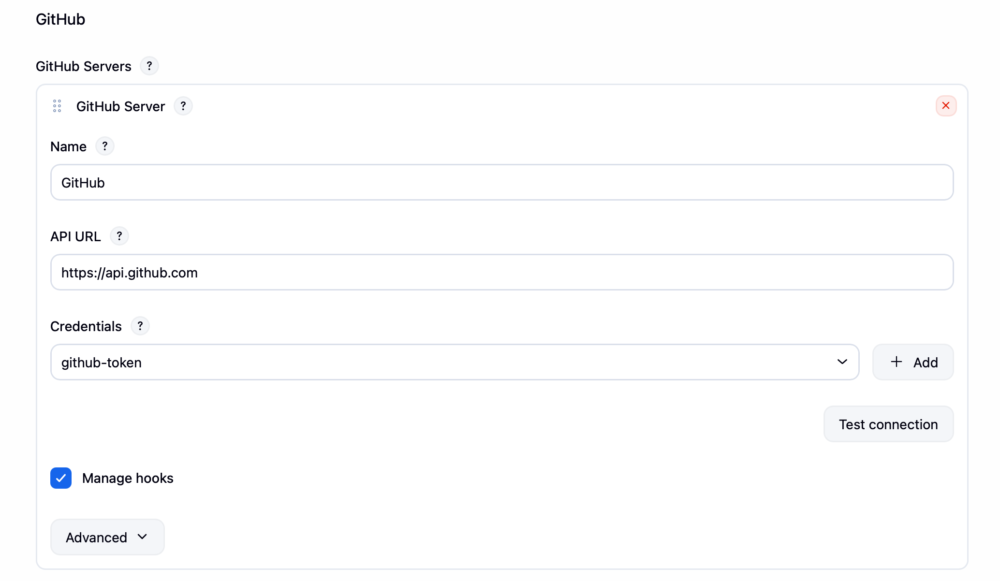
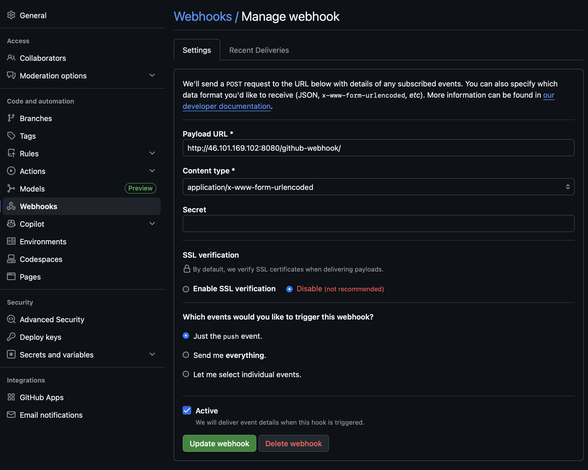

# Module 8 - Build Automation & CI/CD with Jenkins

This repository contains a demo project created as part of my **DevOps studies** in the **TechWorld with Nana – DevOps Bootcamp**.

https://www.techworld-with-nana.com/devops-bootcamp

***Demo Project:*** Configure Webhook to trigger CI Pipeline automatically on every change

***Technologies used:*** Jenkins, GitHub, Git, Docker, Java, Maven

***Project Description:*** 

- Install GitHub Plugin in Jenkins
- Configure GitHub access token and connection to Jenkins in GitHub project settings
- Configure Jenkins to trigger the CI pipeline, whenever a change is pushed to GitHub

---

### Install Github plugins in Jenkins

Required plugins:

- `GitHub Plugin`
- `GitHub Integration`

- Navigate to Manage Jenkins -> Plugins -> Installed plugins

- Check if required plugins is pre-installed, otherwise select the Available tab. Locate the plugins by searching for them

### Configure GitHub access token and connection to Jenkins in GitHub project settings

1. Navigate to Manage Jenkins -> System -> GitHub section

2. Add GitHub Server

Name: `GitHub`

API URL: `https://api.github.com`

3. Add credentials

- Create a Github token

Navigate to https://github.com/settings/tokens/new

Note: `jenkins`

Token should be registered with scopes:

- `admin:repo_hook` - for managing hooks (read, write and delete old ones)
<!-- - `repo` - to see private repos -->
- `public_repo` - access public repositories
- `repo:status` - to manipulate commit statuses

- Add Secret text

ID: `github-token`
Scope: `Global`
Secret: `<your generated token>`

- Click `Test connection` — you should see "Credentials verified"

- Check `Manage hooks` so Jenkins can auto-create webhooks on GitHub

- Save

### Configure Jenkins to trigger the CI pipeline, whenever a change is pushed to GitHub

1. Create the Jenkins Pipeline Job

Name: `pipeline`

**General tab:**

- Check `GitHub project`

Repo URL: `https://github.com/explicit-logic/jenkins-module-8.4`

**Build Triggers tab:**

- Check `GitHub hook trigger for GITScm polling`

**Pipeline tab**

Definition: `Pipeline script from SCM`

SCM: `Git`

Repository URL: `https://github.com/explicit-logic/jenkins-module-8.4`

Credentials: `github` (your username and password to github account)

Branch: `*/pipeline`

Script Path: `Jenkinsfile`

- Click `Save`

2. Add the Webhook in GitHub

Navigate to Repo → Settings → Webhooks → Add webhook

Payload URL: `http://<DROPLET_IP>:8080/github-webhook/`

SSL verification: `Disable`

Events: `Just the push event`

